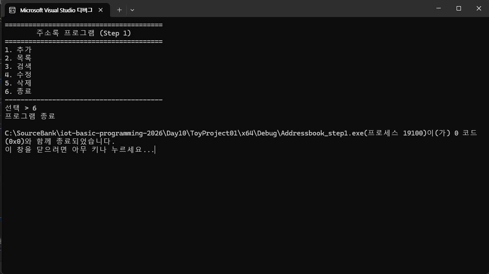
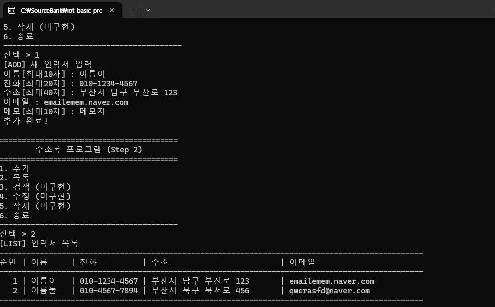

## 토이프로잭트

### 주소록 프로그램

### 개요

- C 기본 학습 후 (구조체, 배열, 포인터, 파일IO, 문자열, 검색, 정렬...) 활용하는 묶음 프로젝트
- DB로 번향하기 전에 가장 좋은 예제
- GUI(Graphic User Interface)는 추후에 가능
- TUI(Test User Interface)도 쉽지 않음

#### 목표 (ADT 근간)

- 연락처 추가/목록/수정/삭제/검색
- 파일 저장/불러오기
- (추가) 정렬/중복체크/csv등으로 내보내기

#### 데이터 모델
- 이름(name), 전화(phone), 이메일(email), 주소(addr), 메모(memo)
- 구조체로 생성

### 스텝 1

- 콘솔 메뉴와 기본 뼈대만 동작

    

    스텝 1결과 화면

### 스텝 2

- 구조체, 배열, 추가/목록 구현
    - Adressbook_step1 폴더를 복사
    - 폴더 이름 변경
    - 폴더 내 x64 폴더 삭제가능
    - 폴더 내, vcxproj(프로젝트 메인파일), .filters, .user 파일 이름 변경
    - VS에서 기존 프로젝트로 추가

    - 구조체, 배열, 추가/목록 구현

    

    스텝 2 결과 화면

### 스텝 3

- 이름으로 검색
- 이름 부분일치 (김 -> 김철수, 김민수 다 검색)
- 결과가 없으면 안내 메시지

    
    스텝 3 결과 화면

### 스텝 4

- 연락처 수정, 삭제
- 삭제는 배열을 앞으로 당기는처리를 추가! count도 -1 감소

    
    스텝 4 결과 화면

### 스텝 5

- 파일 저장/불러오기(영구저장)
- 지금까지 계속 프로그램 종료하면 데이터가 다 날아갔음

### 스텝 6

- 정렬, 중복 체크, 입력검증( 0000@naver.com)

### 스텝 7

- 동적 배열, 대용량 저장 - 100개 이상저장

### 스텝 8

- UI 개선